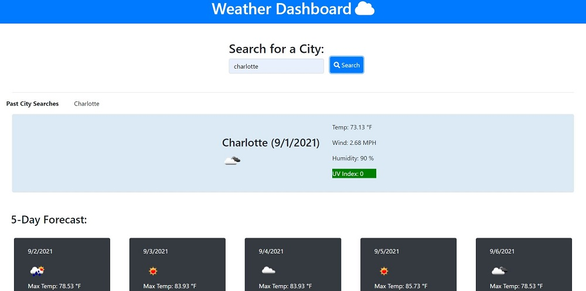

# weather-dashboard

## Name
Weather Dashboard

## Description
Designed a dashboard to display the current weather and 5-Day Forecast for that searched city.

## Links
[Source Code](https://github.com/asantercureton/weather-dashboard)

[Description Link](https://asantercureton.github.io/weather-dashboard/)

## Usage
Display the current city's weather data based on the search input and also show the 5-Day Forecast for that searched city. Past city searches are stored to the localStorage and clicking the past city search buttons will repopulate the data for that specific city searched.

## Screenshots
Below is a screenshot of the project:

---
© 2021 Weather Dashboard.